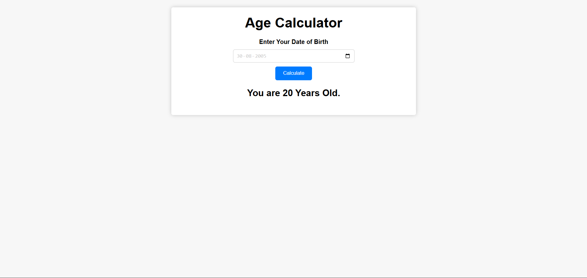

# 🎂 Age Calculator

A simple and responsive **Age Calculator** web app built using **HTML, CSS, and JavaScript**. It calculates your exact age based on your date of birth.

---

## 🚀 Features

* 📅 Select date of birth using a date picker
* ⚡ Instantly calculates age
* 🎯 Accurate age calculation logic
* 💡 Handles edge cases (birthday not yet occurred this year)
* 🎨 Clean and responsive UI

---

## 🛠️ Technologies Used

* HTML5
* CSS3
* JavaScript (Vanilla JS)

---

## 📂 Project Structure

```
├── index.html   # Main HTML file
├── style.css    # Styling
├── app.js       # JavaScript logic
└── README.md    # Project documentation
```

---

## ▶️ How to Run

1. Clone the repository:

```bash
git clone https://github.com/biscuit944/age-calculator.git
```

2. Navigate to the project folder:

```bash
cd age-calculator
```

3. Open `index.html` in your browser.

---

## 🧠 How It Works

* User selects their **date of birth**
* JavaScript calculates:

  * Current year − Birth year
  * Adjusts age if birthday hasn’t occurred yet this year
* Displays the result dynamically on the page

---

## 📸 Preview

```

```

---

## ⚠️ Known Issues / Improvements

* Could improve date validation
* Add support for exact age (years, months, days)
* Enhance UI/UX with animations

---

## 🤝 Contributing

Feel free to fork this repo and improve it!

---

## 📄 License

This project is open-source and available under the **MIT License**.

---

## 👨‍💻 Author

Aditya Jha
GitHub: https://github.com/biscuit944

---
